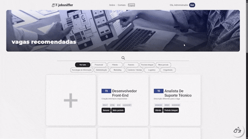
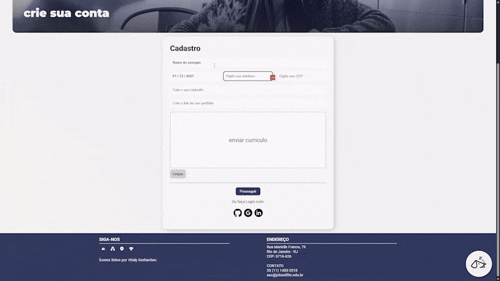

# JobSniffer

[](./readme-en.md)

<p>
  <a href="https://jobsniffer.onrender.com/" target="_blank">
    
  </a>
</p><p>
  
  
  
  
  
  
</p>

---

## Sobre o Projeto

O **JobSniffer** é uma plataforma full stack para busca de vagas, gerenciamento de oportunidades e acompanhamento de candidaturas.

O projeto combina uma arquitetura leve de frontend baseada em Single Page Application (SPA) com um servidor backend em Python/Flask modularizado por meio de Blueprints, utilizando SQLite para persistência dos dados.

A plataforma oferece funcionalidades para dois principais grupos de usuários:

* **Candidatos:** exploração de vagas com filtros instantâneos, candidatura rápida, chatbot para suporte e acompanhamento das candidaturas pelo perfil do usuário.
* **Administradores:** dashboard interativo para análise de oportunidades e cadastros de usuários.

#### **Demonstração:** https://jobsniffer.onrender.com/

---

## Arquitetura e Funcionalidades

### 1. Destaques Técnicos

* Navegação SPA sem frameworks;
* Carregamento dinâmico de scripts;
* Modularização do backend com Flask Blueprints;
* Organização da API REST;
* Fluxo completo de autenticação;
* Dashboard com métricas e estatísticas, entre outras funcionalidades.

### 2. Tecnologias

* Flask
* SQLite
* JavaScript Vanilla
* HTML
* CSS

### 3. Navegação e Roteamento SPA

Garante uma navegação contínua sem recarregamento de páginas, gerenciando a injeção dinâmica de conteúdo e o ciclo de vida dos scripts de cada tela.


| Arquivo              | Responsabilidade                                                         |
| -------------------- | ------------------------------------------------------------------------ |
| `client/js/globalRotas.js`  | Gerencia a troca dinâmica de telas e intercepta os eventos de navegação. |
| `client/js/globalPopups.js` | Utilitário global para modais e alertas visuais do sistema.              |
| `client/js/globalAoTopo.js` | Controla a rolagem suave e outras interações da interface.               |

---

### 4. Vagas, Filtros e Candidaturas

Módulo responsável pela exibição das oportunidades de trabalho, permitindo buscas em tempo real e envio de candidaturas.



| Arquivo / Módulo                   | Responsabilidade                                                           |
| ---------------------------------- | -------------------------------------------------------------------------- |
| `client/js/vagas.js` / `client/js/vagasBanco.js` | Consulta, ordenação e renderização das vagas.                              |
| `client/js/vagasFiltros.js`               | Algoritmos de busca por palavra-chave, área de atuação e tipo de contrato. |
| `client/js/vagasCandidatar.js`            | Gerencia o fluxo de candidatura para uma vaga específica.                  |
| `server/py/rota/vagas.py`                 | Rotas REST para consulta e listagem de vagas.                              |
| `server/py/rota/candidatura.py`           | Processa e registra as candidaturas.                                       |

---

### 5. Dashboard Administrativo

Área voltada para análise estatística dos dados por meio de gráficos interativos.


| Arquivo / Módulo          | Responsabilidade                                           |
| ------------------------- | ---------------------------------------------------------- |
| `client/js/dashboard.js`         | Inicialização do painel e gerenciamento dos dados.         |
| `client/js/dashboardGraficos.js` | Renderização dos gráficos e relatórios estatísticos.       |
| `client/js/dashboardBanco.js`    | Comunicação com as APIs de métricas do backend.            |
| `server/py/rota/dashboard.py`    | Consolida as métricas utilizadas pela área administrativa. |

---

### 6. Autenticação, Perfil e Formulários

Validação dos dados em tempo real no frontend e processamento seguro das informações no servidor.



| Arquivo / Módulo                           | Responsabilidade                                                  |
| ------------------------------------------ | ----------------------------------------------------------------- |
| `client/js/login.js` / `client/js/loginValidacoes.js`    | Controle de autenticação e gerenciamento de sessão.               |
| `client/js/formulariosValidacoes.js`              | Validação de senhas, e-mails e regras de preenchimento.           |
| `client/js/formulariosAutoformatar.js`            | Aplicação dinâmica de máscaras (CEP, telefone e CPF/CNPJ).        |
| `client/js/perfil.js` / `client/js/editar.js`            | Visualização e atualização dos dados do usuário.                  |
| `server/py/rota/login.py` / `server/py/rota/cadastro.py` | Rotas backend para autenticação e cadastro de usuários no SQLite. |

---

### 7. Chatbot e Serviços Auxiliares


| Arquivo / Módulo                         | Responsabilidade                                                                  |
| ---------------------------------------- | --------------------------------------------------------------------------------- |
| `client/js/chatbot.js` / `server/py/rota/chatbot.py`   | Assistente interativo para responder dúvidas rápidas sobre vagas e processos.     |
| `client/js/email.js` / `server/py/email.py`            | Integração responsável pelo envio de notificações e e-mails de confirmação.       |
| `server/py/iniciarBanco.py` / `server/py/sqliteSQL.py` | Scripts para criação da estrutura do banco, inicialização e conexão com o SQLite. |

---

## Como Executar Localmente

### Pré-requisitos

* Python 3.10 ou superior
* Git

### Passo a passo

1. **Clone o repositório:**

```bash
git clone https://github.com/nicovalentim/jobsniffer.git
cd jobsniffer
```

2. **Crie e ative o ambiente virtual:**

#### Windows

```cmd
python -m venv venv
.\venv\Scripts\activate
```

#### Linux/macOS

```bash
python3 -m venv venv
source venv/bin/activate
```

3. **Instale as dependências:**

```bash
pip install -r requirements.txt
```

4. **Execute o servidor:**

```bash
python app.py
```

5. **Acesse no navegador:**

```text
http://127.0.0.1:5000
```

---

## Agradecimentos

Embora o JobSniffer tenha sido idealizado, desenvolvido e mantido principalmente por mim, gostaria de agradecer:

* [Rods](https://github.com/Rodsmont) pela criação do conjunto original de dados em SQL utilizado durante o desenvolvimento.
* [Rocharlia](https://github.com/rocharlia) pelo desenvolvimento do módulo do chatbot, e a função de filtragem de vagas.

